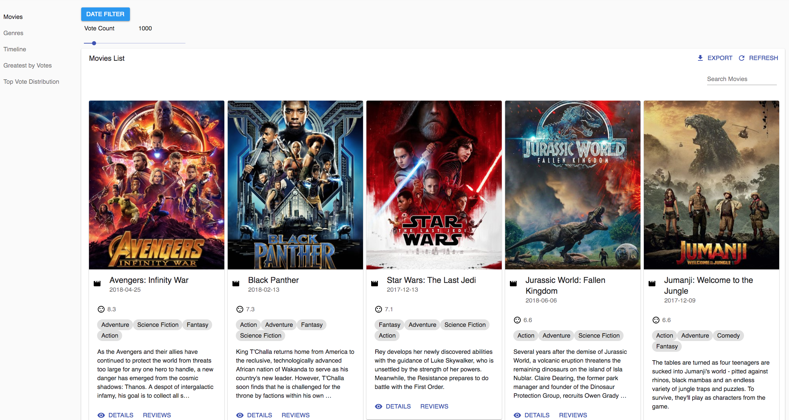
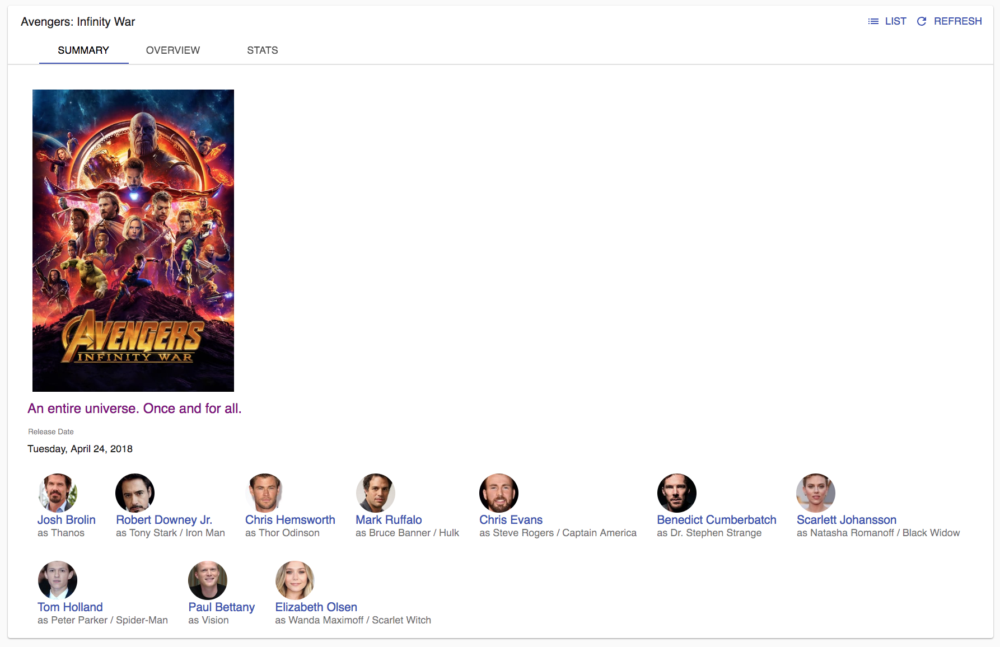
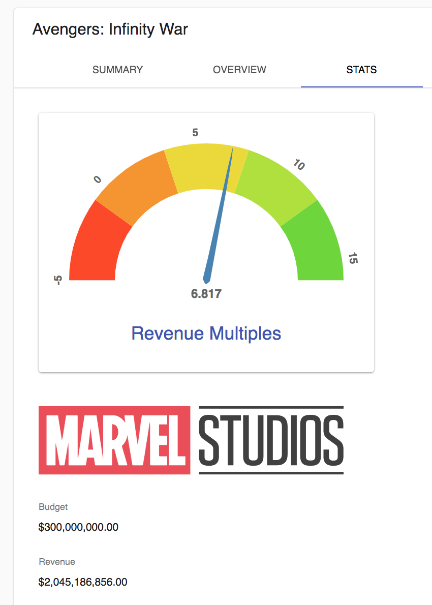
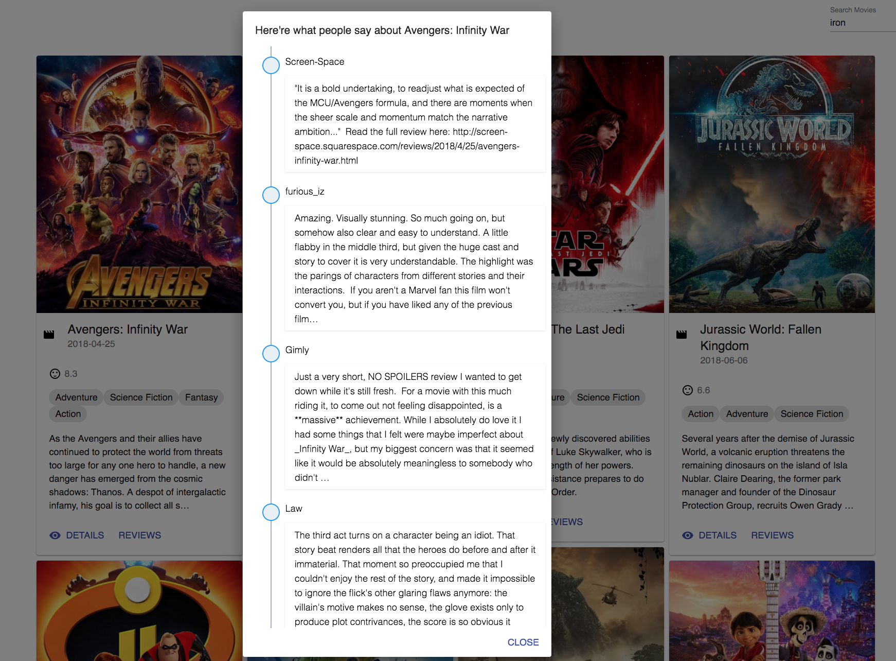
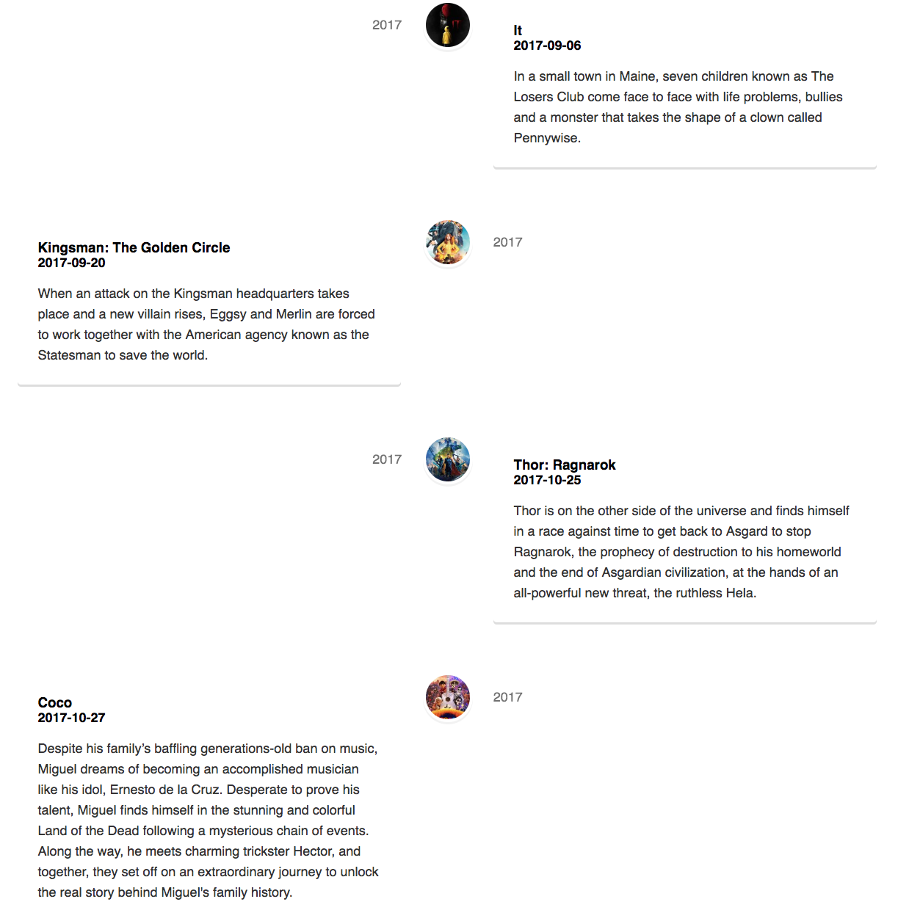

A movie dashboard using the react-admin framework and themoviedb API backend <br/>
[(https://tiny.cc/qbvpxy)](https://tiny.cc/qbvpxy)

<br>



## Table of Contents

- [Introduction](#introduction)
- [Installation](#installation)
- [Technical Implementation](#technical-implementation)
- [Screenshots](#screenshots)

## Introduction

This React/Redux application shows info about the movies from themoviedb API, information such as who starred in the movie, whether the film is profitable, from which production companies, etc. It also show some reviews, visualized stats, and timeline of the filtered movies. Vote results from themoviedb API are also present in the app.  
<br/>

# Installation

Development

```sh
git clone https://github.com/mrpaxton/react-admin-movies.git
```

```sh
yarn install
```

```sh
yarn start
```

## Technical Implementation

> The following are the example of awesome framework and libraries used in this movie-admin-movies project

- [x] `react-admin` Utilizing material UI, this framework has many useful components and mechanics to create an admin dashboard. It supports responsive design, provides CRUD functionality for the front-end, offers a skeleton for REST data provider to communicate with multiple backends, enable searching and pagination, allows for exporting resource data to the CSV format, to name a few.
- [x] `react-stack-grid` Pinterest like layout to present a list of React components. Implemented to show movie grids
- [x] `react-day-picker` A flexible date picker for React. Used to filter the movies by release date
- [x] `react-d3-speedometer` To present movie profitability in the movie detail's stats tab
- [x] `react-event-timeline` To show the movie reviews from the popup dialog from the movie grid
- [x] `react-vertical-timeline-component` To show the filtered movies in a chronological order
- [x] `react-vis, victory, and dx-chart` for some movie stat visualization
- [x] `recompose` compose the currying functions that returns higher order components(HOCs). VoteSlideFilter component is functional-based using recompose to combine decorators, thus allowing us to add handlers, simple local states, withStyles, etc, in a very readable fashion. For example:

```js

...

const enhance = compose(
  withConnectedRedux,
  withState("voteCount", "setVoteCount", 1000),
  withHandlers({
    onVoteCountChange: onVoteChangeHandler
  }),
  withStyles(styles)
);

export default enhance(VoteFilterSlider);
```

## Screenshots


<br/>

<br/>

<br/>

<br/>
